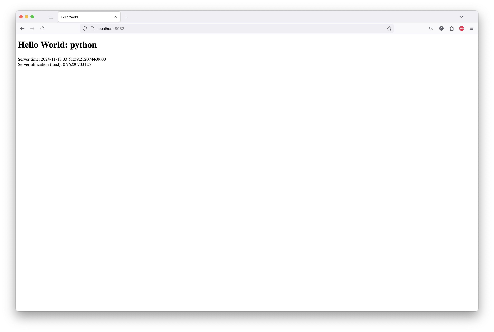

#### Docker build:

```
$ docker build -t python-helloworld .
[+] Building 15.0s (7/7) FINISHED                                                                                                                                                                                             docker:desktop-linux
 => [internal] load build definition from Dockerfile                                                                                                                                                                                          0.0s
 => => transferring dockerfile: 175B                                                                                                                                                                                                          0.0s
 => [internal] load metadata for docker.io/library/python:3                                                                                                                                                                                   3.1s
 => [internal] load .dockerignore                                                                                                                                                                                                             0.0s
 => => transferring context: 2B                                                                                                                                                                                                               0.0s
 => [internal] load build context                                                                                                                                                                                                             0.0s
 => => transferring context: 928B                                                                                                                                                                                                             0.0s
 => [1/2] FROM docker.io/library/python:3@sha256:bc78d3c007f86dbb87d711b8b082d9d564b8025487e780d24ccb8581d83ef8b0                                                                                                                            11.6s
 => => resolve docker.io/library/python:3@sha256:bc78d3c007f86dbb87d711b8b082d9d564b8025487e780d24ccb8581d83ef8b0                                                                                                                             0.0s
 => => sha256:62639b6c3f3e77ebbbf3f18802d08351636f8dd6e0a94d1b225e9f5dc1c88044 6.07kB / 6.07kB                                                                                                                                                0.0s
 => => sha256:8bc6ea9985d6735252067a2041e797c0dedef261a9695671fa4ef7891a96e4b5 64.35MB / 64.35MB                                                                                                                                              3.5s
 => => sha256:bc78d3c007f86dbb87d711b8b082d9d564b8025487e780d24ccb8581d83ef8b0 9.72kB / 9.72kB                                                                                                                                                0.0s
 => => sha256:d63c40005214851e1d90c26c42e9c736b980516a0b88765caa8039e1378bada0 2.33kB / 2.33kB                                                                                                                                                0.0s
 => => sha256:1a3f1864ec54b1398987bbe673e93d8b09842ecd51e86ab87d64857b70d188b1 49.59MB / 49.59MB                                                                                                                                              1.2s
 => => sha256:464f864cfaa846fbe1b8a889827404e18374f805d29d77c288a813ae8c4f6d91 23.60MB / 23.60MB                                                                                                                                              3.6s
 => => extracting sha256:1a3f1864ec54b1398987bbe673e93d8b09842ecd51e86ab87d64857b70d188b1                                                                                                                                                     1.5s
 => => sha256:9cbd322119a1fd6eb9df75f74273f9136ccdf6317336352e605b41d5e5cf941f 202.68MB / 202.68MB                                                                                                                                            6.7s
 => => sha256:b12614aa3190271f1bfeda083dde37e14965c886413cb3879a08972a9b0d3964 6.24MB / 6.24MB                                                                                                                                                5.0s
 => => extracting sha256:464f864cfaa846fbe1b8a889827404e18374f805d29d77c288a813ae8c4f6d91                                                                                                                                                     0.4s
 => => sha256:0c20aaaaf2cb8bb2588e7dcb7865ae55811ad8768cc1084994ae8e169ae877e6 26.38MB / 26.38MB                                                                                                                                              5.2s
 => => extracting sha256:8bc6ea9985d6735252067a2041e797c0dedef261a9695671fa4ef7891a96e4b5                                                                                                                                                     1.7s
 => => sha256:e93c1a033bf9a65319f72b092edd67e323ebcf5bccaaf5202f996f130d697b29 250B / 250B                                                                                                                                                    6.4s
 => => extracting sha256:9cbd322119a1fd6eb9df75f74273f9136ccdf6317336352e605b41d5e5cf941f                                                                                                                                                     4.0s
 => => extracting sha256:b12614aa3190271f1bfeda083dde37e14965c886413cb3879a08972a9b0d3964                                                                                                                                                     0.2s
 => => extracting sha256:0c20aaaaf2cb8bb2588e7dcb7865ae55811ad8768cc1084994ae8e169ae877e6                                                                                                                                                     0.5s
 => => extracting sha256:e93c1a033bf9a65319f72b092edd67e323ebcf5bccaaf5202f996f130d697b29                                                                                                                                                     0.0s
 => [2/2] COPY server.py /src/                                                                                                                                                                                                                0.3s
 => exporting to image                                                                                                                                                                                                                        0.0s
 => => exporting layers                                                                                                                                                                                                                       0.0s
 => => writing image sha256:114dff1d200302e7e10efc185b1c791c3e5001c766c91d0441fd87c231d76181                                                                                                                                                  0.0s
 => => naming to docker.io/library/python-helloworld                                                                                                                                                                                          0.0s

View build details: docker-desktop://dashboard/build/desktop-linux/desktop-linux/ndi3jus1p9wc0thud93wzw7do

What's next:
    View a summary of image vulnerabilities and recommendations → docker scout quickview 
$
```

#### Docker run:

```
$ docker run -d --name python-helloworld -p 8082:8080 python-helloworld
ca2d513382bfccb044ce990555dc6dc1bb93c425dddd0a67d03956a39e1aaa72
$
$ docker ps
CONTAINER ID   IMAGE                   COMMAND                  CREATED          STATUS          PORTS                    NAMES
ca2d513382bf   python-helloworld       "python /src/server.…"   18 seconds ago   Up 18 seconds   0.0.0.0:8082->8080/tcp   python-helloworld
284f8f50d24a   nodejs-helloworld       "docker-entrypoint.s…"   17 minutes ago   Up 17 minutes   0.0.0.0:8081->8080/tcp   nodejs-helloworld
82c1d53a9ae7   apache-php-helloworld   "docker-php-entrypoi…"   28 minutes ago   Up 28 minutes   0.0.0.0:8080->80/tcp     apache-php-helloworld
$
```

