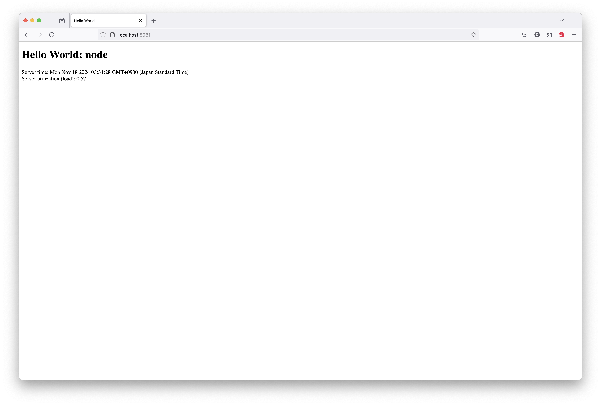

#### docker build:

```
$ docker build -t nodejs-helloworld .
[+] Building 2.0s (7/7) FINISHED                                                                                                                                                                                              docker:desktop-linux
 => [internal] load build definition from Dockerfile                                                                                                                                                                                          0.0s
 => => transferring dockerfile: 168B                                                                                                                                                                                                          0.0s
 => [internal] load metadata for docker.io/library/node:16                                                                                                                                                                                    1.9s
 => [internal] load .dockerignore                                                                                                                                                                                                             0.0s
 => => transferring context: 2B                                                                                                                                                                                                               0.0s
 => [internal] load build context                                                                                                                                                                                                             0.0s
 => => transferring context: 611B                                                                                                                                                                                                             0.0s
 => CACHED [1/2] FROM docker.io/library/node:16@sha256:f77a1aef2da8d83e45ec990f45df50f1a286c5fe8bbfb8c6e4246c6389705c0b                                                                                                                       0.0s
 => [2/2] COPY server.js /src/                                                                                                                                                                                                                0.0s
 => exporting to image                                                                                                                                                                                                                        0.0s
 => => exporting layers                                                                                                                                                                                                                       0.0s
 => => writing image sha256:ff8a6c60e718e8507cccae0562366dd5c7358c8a6b946ad3d426f5726997437c                                                                                                                                                  0.0s
 => => naming to docker.io/library/nodejs-helloworld                                                                                                                                                                                          0.0s

View build details: docker-desktop://dashboard/build/desktop-linux/desktop-linux/tqhe6r9c6shq1z8l6ns09qac2

What's next:
    View a summary of image vulnerabilities and recommendations → docker scout quickview 
$
```

#### docker run:

```
$ docker run -d --name nodejs-helloworld -p 8081:8080 nodejs-helloworld
284f8f50d24aa90c50999847e7d6ef497ce21225068944dfe6bc8d4388704045
$
```

